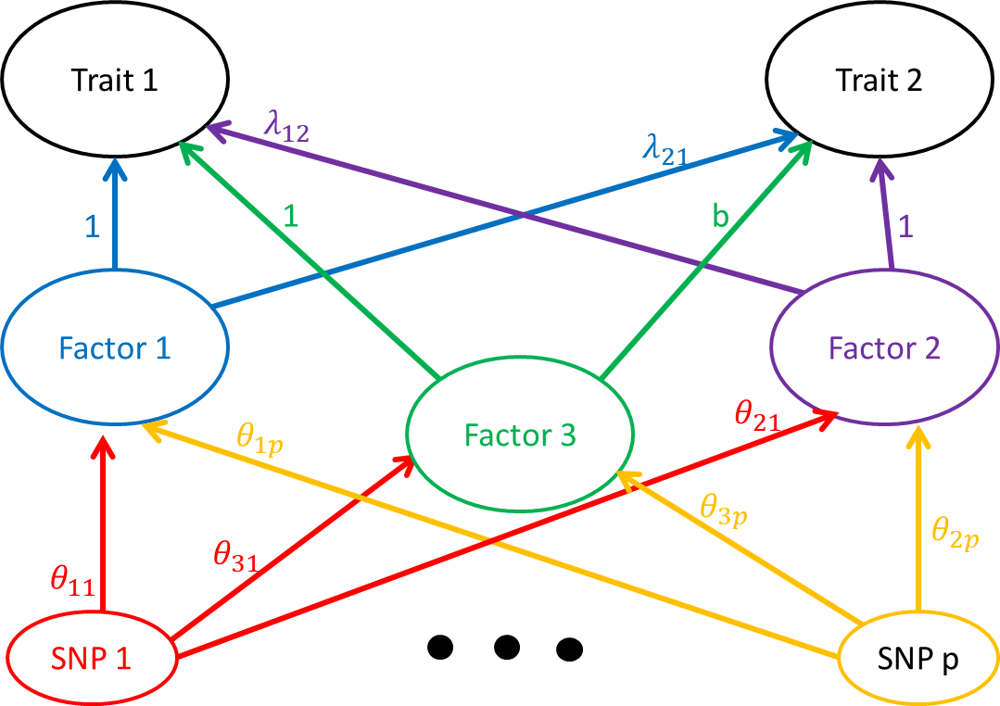
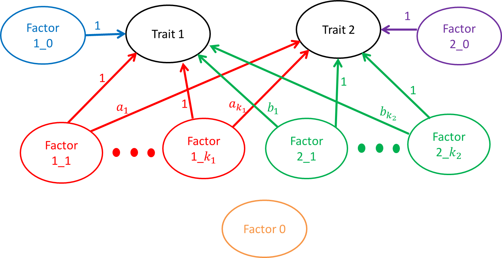

```{r setup, include=FALSE}
knitr::opts_chunk$set(echo = TRUE)
```

## Introduction
In this document I will discuss a three factor extension of the two factor model discussed [here](two_factor.html). We use the same notation and the same model for the distribution of $(\hat{\beta}_1, \hat{\beta}_2)$ conditional on the true effects $\beta_1$ and $\beta_2$:

$$
\begin{pmatrix}
\hat{\beta}_{1j}\\\hat{\beta}_{2j}
\end{pmatrix} \sim N\left(\begin{pmatrix}
\beta_{1j}\\\ \beta_{2j}
\end{pmatrix} , \begin{pmatrix}
s_{1j}^2 & \rho s_{1j}s_{2j} \\ 
\rho s_{1j}s_{2j} & s_{2j}^2
\end{pmatrix}\right)
$$
As in the previous model, we model the true effects as linear combinations of SNP effects on factors.

$$
\begin{pmatrix}
\beta_{1j}\\\ \beta_{2j}
\end{pmatrix} = A\theta_j
$$

However, in this model $\theta = (\theta_1, \theta_2, \theta_3)^{\top}$ and $A$ is a 2 by 3 matrix. 

$$A = \begin{pmatrix}1 & \lambda_{12} & 1 \\ \lambda_{21} & 1 & b \end{pmatrix}$$
The graphical representation of this model is here:



The reason for setting the effect of factor 3 on trait 1 to 1 is to provide a scale for the SNP effects on factor 3. The third factor is intended to capture shared effects, hoewever, you can see in the graph above that factors 1 and 3 are equivalent. The only way to distinguish them is to put a different prior on $\theta_1$ than on $\theta_3$. For example, we might assume that all of the large effects on trait 1 are mediated through factor 1 rather than factor 3. However, this doesn't fully capture the intuition we are hoping to get at. 

Ideally, a model that accounts for the possibility of sharing should have thse qualities:
1. If all effects are shared (i.e. every SNP that effects trait 1 also effects trait 2 and vice versa), this is less indicative of causal relationships than of complete sharing.

2. If the relationship is asymmetrical e.g. all of the SNPs that effect trait 1 also effect trait 2 but there are some SNPs that only effect trait 2, this indicates a causal relationship of trait 1 on trait 2.

3. If there are some shared SNPs but both traits have some unique effect SNPs, this indicates that there is no causal relationship.

In the first and third cases we should have evidence to set the causal parameters to 0. However, in the second case, it is very difficult to know the proportion of SNP effects due to sharing vs the causal relationship.


## Alternative approach
Based on the above intuition, we might consider a model something like this




In this model, there are many factors. Factor 0 doesn't act on either of the traits. Factors 1_0 and 2_0 are un-shared. SNPs that act on these factors will effect only trait 1 or trait 2 but not both. The other factors have some shared effects. We could consider a problem in which we fix a grid of values for $a_1, \dots a_{k_1}$ and $b_1, \dots, b_{k_2}$. We think of each SNP as acting through only one of the factors and try to estimate the proportion of SNPs in each category. We have evidence for causality when the proportion of SNPs effecting one of factors 1_0 or 2_0 is (close to) zero AND there is some weight on at least one of the shared factors. If the weight on both factors 1_0 and 2_0 are (close to) zero then we have more evidence for sharing than causality.


