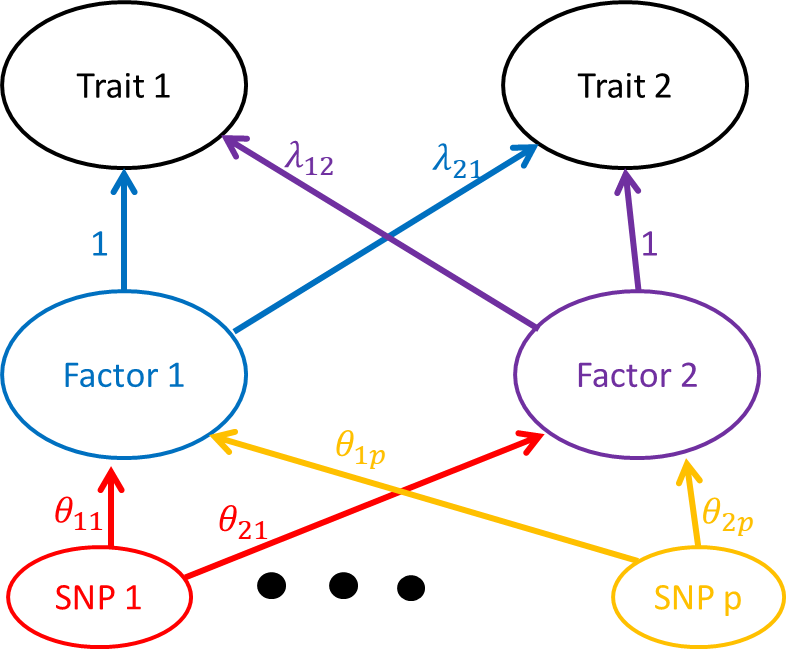

```{r setup, include=FALSE}
knitr::opts_chunk$set(echo = TRUE)
```

## Introduction

In this document I will describe the two factor model for assessing relationships between traits. This is an extension of what I called the "correlation approach" in [these notes](sherlock2_compound_and_correlation.pdf). Using the same notation as in that earlier document, the raw data are $\hat{\beta}_1$, $\hat{\beta}_2$, $s_1$ and $s_2$. Each of these is a length $p$ vector. $\hat{\beta}_{1j}$ and $\hat{\beta}_{2j}$ give estimated effect sizes of SNP $j$ on traits 1 and 2 respectively. $s_{1j}$ and $s_{2j}$ give the estimated standard errors of $\hat{\beta}_{1j}$ and $\hat{\beta}_{2j}$. Our model is as follows:

$$
\begin{pmatrix}
\hat{\beta}_{1j}\\\hat{\beta}_{2j}
\end{pmatrix} \sim N\left(\begin{pmatrix}
\beta_{1j}\\\ \beta_{2j}
\end{pmatrix} , \begin{pmatrix}
s_{1j}^2 & \rho s_{1j}s_{2j} \\ 
\rho s_{1j}s_{2j} & s_{2j}^2
\end{pmatrix}\right)
$$
The parameter $\rho$ captures correlation between estimates conditional on the true effect sizes. This might result from having overlapping samples or population structure that hasn't been accounted for. Throughout, we will treat $s_1$ and $s_2$ as fixed and known.

We model the distribution of the true effects, $\beta_{1j}$ and $\beta_{2j}$ as 
$$
\begin{pmatrix}
\beta_{1j}\\\ \beta_{2j}
\end{pmatrix} = A\theta_j
$$
where $A = \begin{pmatrix}1 & \lambda_{12}\\ \lambda_{21} & 1 \end{pmatrix}$ and $\theta_j = (\theta_{1j}, \theta_{2j})^{\top}$. One graphical way of thinking of this model is this:



There are two factors with effects on two traits. $\theta_{ij}$ is the effect of SNP j on factor $i$. For identifiability, the SNP effects on factor $i$ are scaled to the scale of SNP effects on trait $i$ by setting the diagonal elements of $A$ to be equal to 1. One way to think of this is that factor $i$ is very similar to trait $i$ and $\lambda_{12}$ and $\lambda_{21}$ are similar to the effect of trait 2 on trait 1 and vice-versa. 


To fit the model, we estimate a prior for $\theta_j$ from the data and then choose parameters $\lambda_{12}$, $\lambda_{21}$, and $\rho$ to maximize the likelihood of the data. We can estimate the variance of these estimates using the derivative of the likelihood function. So far in this discussion we have assumed independence between SNPs but we will discuss this a little later on.

## Estimating a prior for $\theta_j$
We assume that $\theta_j$ has a distribution that is a mixture of $k$ bivariate normal distributions

$$
P\left[ \begin{pmatrix}
\theta_{1j}\\\ \theta_{2j}
\end{pmatrix}\right] = \sum_{k=1}^{K} \pi_k N\left( \begin{pmatrix}
\theta_{1j}\\\ \theta_{2j}
\end{pmatrix};  \begin{pmatrix}0 \\0 \end{pmatrix}, U_k\
\right)
$$
 where $U_k =  \begin{pmatrix}\sigma_{1k} & 0 \\ 0 & \sigma_{2k}\end{pmatrix}$. So far we have used two strategies for estimating the $U_k$ and the $\pi_k$:
 
1. Independent priors for $\theta_{1j}$ and $\theta_{2j}$: Use ASH to estimate the distribution of SNP effects on trait 1 and on trait 2 separately. This gives us two grids of variances $\sigma_{1,1}, \dots, \sigma_{1,k_1}$ and $\sigma_{2,1}, \dots, \sigma_{2,k_2}$ with corresponding mixing proportions $\pi_{1,1}, \dots , \pi_{1,k_1}$ and $\pi_{2,1}, \dots, \pi_{2,k_2}$. Our prior for the joint distribution of $\begin{pmatrix}
\theta_{1j}\\\ \theta_{2j}
\end{pmatrix}$ is then 

$$
P[\theta_{1j}] = \sum_{k=1}^{k_1} \pi_k N(\theta_{1j}; 0, \sigma_{1, k})
$$
$$
P[\theta_{2j}] = \sum_{k=1}^{k_2} \pi_k N(\theta_{2j}; 0, \sigma_{2, k})
$$
$$
P\left[ \begin{pmatrix}
\theta_{1j}\\\ \theta_{2j}
\end{pmatrix}\right]  = P[\theta_{1j}]P[\theta_{2j}]
$$

2. Joint prior for  $\theta_{1j}$ and $\theta_{2j}$: This is an iterative procedure and we have approached it in two ways. First, as before, use ASH to estimate the distribution of SNP effects on trait 1 and on trait 2 separately. Now either

      2a. Thin both grids, keeping only the variances associated with mixing proportions larger than a small threshold (e.g. $10^{-10}$). Form a bivariate grid of $U_k$s by taking all combinations of these smaller grids. Estimate the mixing proportions for the $U_k$s using ASH machinery.
      
      2b. Form a bivariate grid of $U_k$s using all combinations of the two (unthinned) grids. Use ASH machinery to estimate the mixing proportions for this large set of variance matrices, then thin the bivariate grid based on the mixing proportions. 
      
    In either case 2a or 2b, we estimate the mixing proportions twice. The first time we assume that $\lambda_{12} = \lambda_{21} = \rho = 0$. We then estimate $\rho$ assuming that $\lambda_{12} = \lambda_{21} = 0$ and then reestimate mixing proportions using the estimated value of $\rho$. In practice we find little change between the first and second iteration.
 
 
## Comparing models
We are especially interested in hypotheses about whether one or both of $\lambda_{12}$ and $\lambda_{21}$ are equal to zero. To assess this we fit the model under four sets of constraints:

1. $\lambda_{12}=\lambda_{21} = 0$
2. $\lambda_{12}$ is free; $\lambda_{21}=0$
3. $\lambda_{12} = 0$; $\lambda_{21}$ is free
4. Both $\lambda_{12}$ and $\lambda_{21}$ free

We can then compare models using either BIC or a likelihood ratio test.

## Accounting for LD
So far, the model has assumed that SNPs are independent, however, we know that the effect of SNP $j$ is likely to be similar to the effects of the SNPs that in close LD with it. Dependence between SNPs will lead to underestimates of the variance of the parameter estimates if we don't account for it.
Placing a joint prior on $\theta_1, \dots, \theta_{p}$ would be intractible. Instead, we use two strategies to try to get better variance estimates:

1. Pruning based on an LD threshold. This also has the effect of dramatically reducing the number of SNPs and speeding up computations.

2. Incorporating weights into the likelihood. Rather than calculating the likelihood as
$$
L(\lambda_{12}, \lambda_{21}, \rho \vert \hat{\beta}_1, \hat{\beta}_2, s_1, s_2) = \prod_{j=1}^{p} P(\hat{\beta}_{1j}, \hat{\beta}_{2j} \vert \lambda_{12}, \lambda_{21}, \rho, s_{1j}, s_{2j})
$$
we use

$$
L(\lambda_{12}, \lambda_{21}, \rho \vert \hat{\beta}_1, \hat{\beta}_2, s_1, s_2) = \prod_{j=1}^{p} \left(P(\hat{\beta}_{1j}, \hat{\beta}_{2j} \vert \lambda_{12}, \lambda_{21}, \rho, s_{1j}, s_{2j})\right)^{w_j}
$$
where $w_j$ is a weight less than 1. Intuitively, $w_j$ reduces the contribution of a SNP with many neighbors in close LD. We use weights calculated by the [LDAK program](http://dougspeed.com/ldak/). These weights have the property that if $N$ SNPs are in perfect LD, each SNP will recieve a weight of $1/N$ so that cumulatively, the block only gets one "vote" in the likelihood rather than $N$. 
